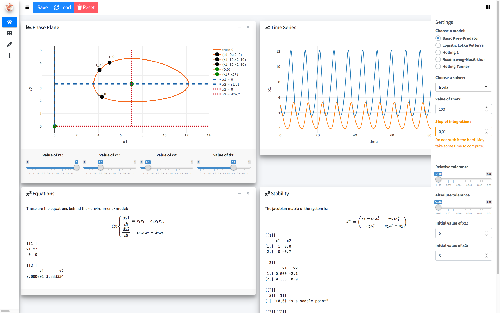
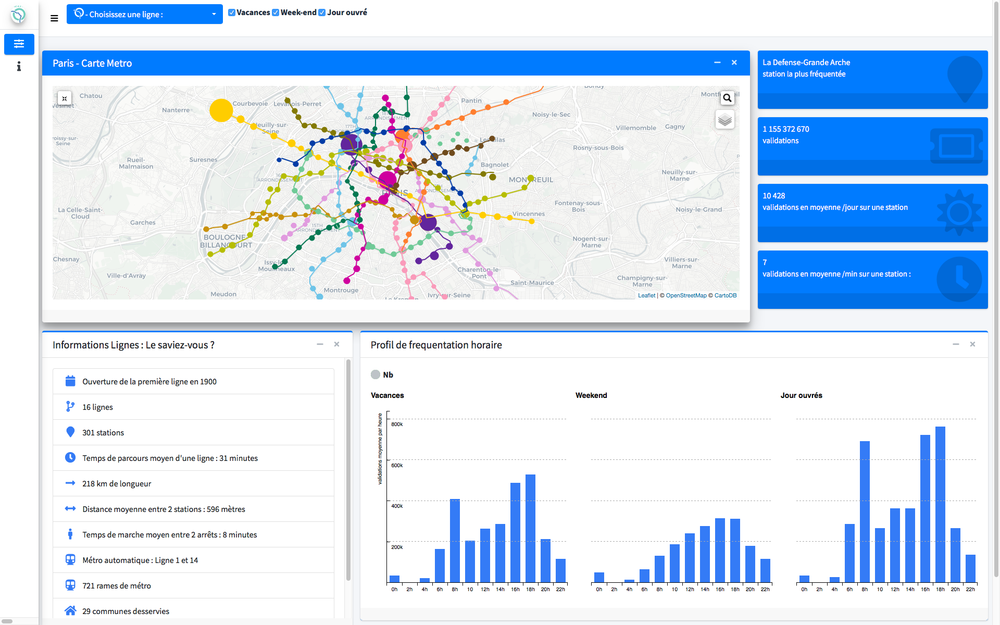

# bs4Dash 

[](https://travis-ci.org/RinteRface/bs4Dash)
[](https://CRAN.R-project.org/package=bs4Dash)
[](https://www.tidyverse.org/lifecycle/#stable)
[](https://CRAN.R-project.org/package=bs4Dash)
[](https://www.rpackages.io/package/bs4Dash)

> Bootstrap 4 shinydashboard using AdminLTE3

<br>

<div class="row">
<div class="col-sm-4" align="center">
<div class="card">
<a href="https://rinterface.com/shiny/showcase/lorenz/" target="_blank"></a>
</div>
</div>
<div class="col-sm-4" align="center">
<div class="card">
<a href="https://rinterface.com/shiny/showcase/lotkaVolterra/" target="_blank"></a>
</div>
</div>
<div class="col-sm-4" align="center">
<div class="card">
<a href="https://rinterface.com/shiny/showcase/ratp/" target="_blank"></a>
</div>
</div>
</div>

<br>

See a working example on shinyapps.io [here](https://dgranjon.shinyapps.io/bs4DashDemo/).

## Useful Informations (if any)

...

## Installation

This package is on CRAN:

```r
# from CRAN
install.packages("bs4Dash")
# latest devel version
devtools::install_github("RinteRface/bs4Dash")
```

## Demo

See a preview of the package [here](https://rinterface.com/shiny/bs4Dash/classic/) and
[here](https://rinterface.com/shiny/bs4Dash/classic/old_school) or run

```r
library(bs4Dash)
# classic theme
bs4DashGallery()
# old_school theme
bs4DashGallery(theme = "old_school")
```

An applied example can be found [here](https://rinterface.com/shiny/showcase/ratp/) (the 
original dashboard was made by [Philippine Rheins](https://twitter.com/PhilippineRs) 
from [dreamRs](https://twitter.com/dreamRs_fr)).

## Issues

Issues are listed [here](https://github.com/RinteRface/bs4Dash/issues). 