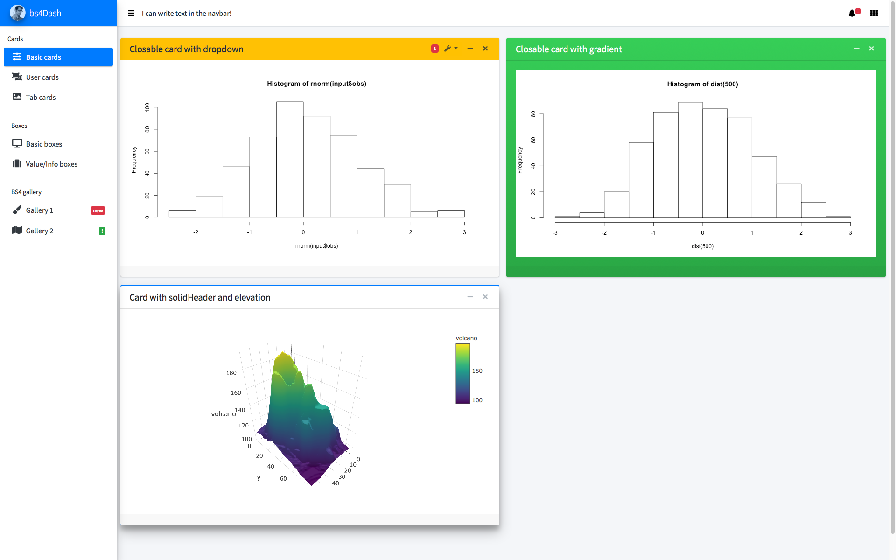

# bs4Dash
[](https://travis-ci.org/DivadNojnarg/bs4Dash)
[](https://CRAN.R-project.org/package=bs4Dash)
[](https://www.tidyverse.org/lifecycle/#stable)
[](https://CRAN.R-project.org/package=bs4Dash)
[](https://www.rpackages.io/package/bs4Dash)
[](http://www.repostatus.org/#wip)

> Bootstrap 4 shinydashboard using AdminLTE3


<br>

See a working example [here](https://dgranjon.shinyapps.io/bs4DashDemo/).

## Installation

This package is on CRAN:

```r
# from CRAN
install.packages("bs4Dash")
# latest devel version
devtools::install_github("DivadNojnarg/bs4Dash")
```

## Demo

See a preview of the package [here](http://130.60.24.205/bs4Dash/showcase/classic) and
[here](http://130.60.24.205/bs4Dash/showcase/old_school) or run

```r
library(bs4Dash)
# classic theme
bs4DashGallery()
# old_school theme
bs4DashGallery(theme = "old_school")
```

An applied example can be found [here](http://130.60.24.205/dreamRs_ratp/) (the 
original dashboard was made by [Philippine Rheins](https://twitter.com/PhilippineRs) 
from [dreamRs](https://twitter.com/dreamRs_fr)).

## Issues

Issues are listed [here](https://github.com/DivadNojnarg/bs4Dash/issues). 