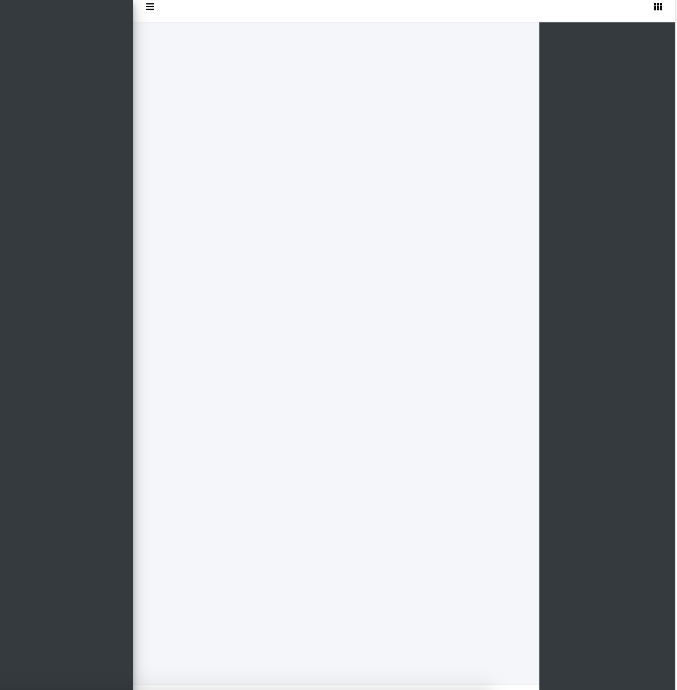
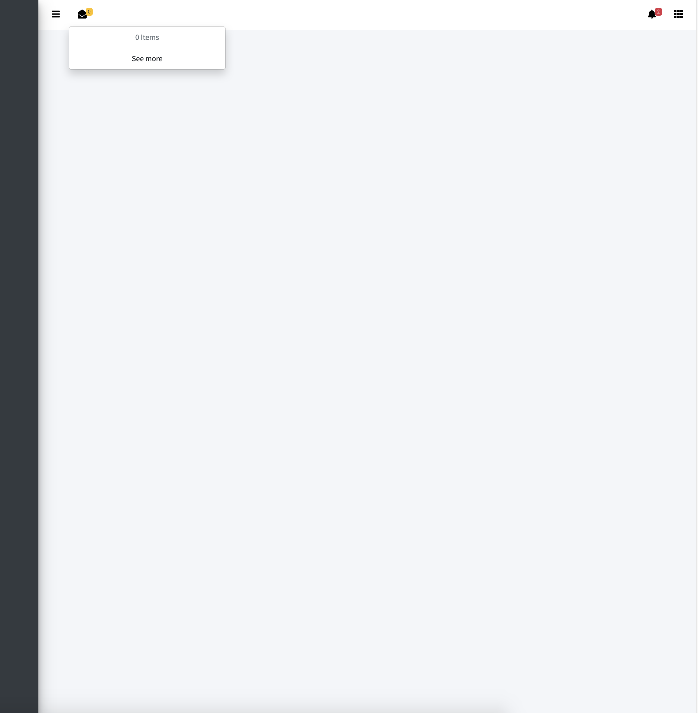
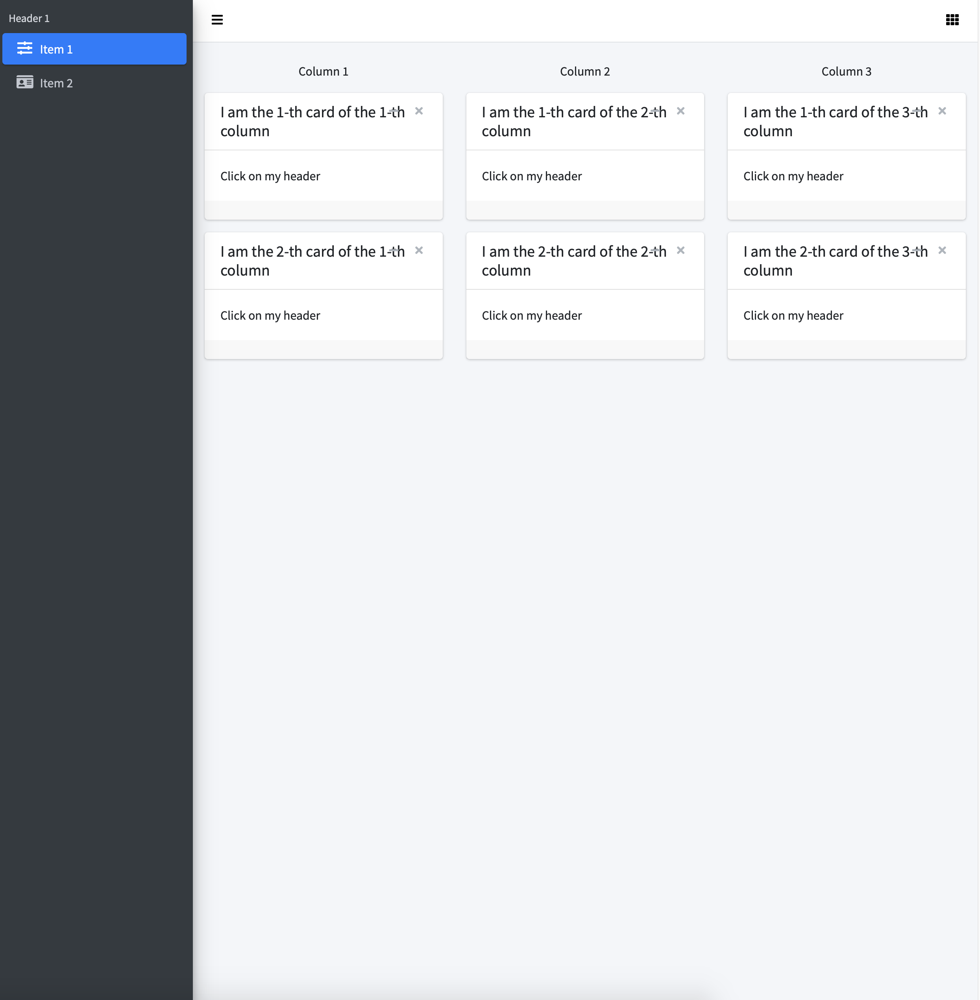

Below is a step by step introduction to the bs4Dash structure. This is voluntarily very similar to shinydashboard,
preventing users from having to learn another exotic framework.

## Create a basic page 

This is the template to start with bs4Dash:

```r
library(shiny)
library(bs4Dash)

 shiny::shinyApp(
  ui = bs4DashPage(
   old_school = FALSE,
   sidebar_min = TRUE,
   sidebar_collapsed = FALSE,
   controlbar_collapsed = FALSE,
   controlbar_overlay = TRUE,
   title = "Basic Dashboard",
   navbar = bs4DashNavbar(),
   sidebar = bs4DashSidebar(),
   controlbar = bs4DashControlbar(),
   footer = bs4DashFooter(),
   body = bs4DashBody()
  ),
  server = function(input, output) {}
)
```


<br>

The `bs4DashPage()` takes optional argument such as *old_school*, which is FALSE by default. Whenever it is 
TRUE, the page will have a fancy old design. The *sidebar_collapsed* argument enables to control how the `bs4DashSidebar()` is displayed when the app starts. Similarly, *controlbar_collapsed* allow you to decide whether to display the `bs4DashControlbar()`.
When *sidebar_mini* is TRUE, the sidebar icons are visible even when the sidebar is collapsed.
Finally, you can also give a *title* to the page.

Now, it is time to fill this template!

## Sidebar Setup

We will use the `bs4DashSidebar()` function:

```r
bs4DashSidebar(
 skin = "light",
 status = "primary",
 title = "bs4Dash",
 brandColor = "primary",
 url = "https://www.google.fr",
 src = "https://adminlte.io/themes/AdminLTE/dist/img/user2-160x160.jpg",
 elevation = 3,
 opacity = 0.8,
 bs4SidebarUserPanel(
  img = "https://image.flaticon.com/icons/svg/1149/1149168.svg", 
  text = "Welcome Onboard!"
 ),
 bs4SidebarMenu(
   bs4SidebarHeader("Header 1"),
   bs4SidebarMenuItem(
     "Item 1",
     tabName = "item1",
     icon = "sliders"
   ),
   bs4SidebarMenuItem(
     "Item 2",
     tabName = "item2",
     icon = "id-card"
   )
 )
)
```

A lot of options are available:
  * two skins are available, namely "light" or "dark". I recommand using the "light" one.
  * the title is only displayed when the sidebar is uncollapsed!
  * the sidebar status determins which color `bs4SidebarMenuItem()` have. There are 5 different colors:
    "primary", "danger", "warning", "success", "info".
  * brandColor: bakground color of the sidebar brand. I recommand using the same color as that chosen for     status.
  * src: sidebar brand image. SVGs, JPEG, PNG accepted.

I do not recommand to change the *elevation* nor *opacity*, altough possible.


<br>

## Navbar Setup

We will use the `bs4DashNavbar()` function:

```r
bs4DashNavbar(
 skin = "light",
 status = "white",
 border = TRUE,
 sidebarIcon = "bars",
 controlbarIcon = "th",
 leftUi = bs4DropdownMenu(
   show = TRUE,
   align = "left",
   status = "warning", 
   menuIcon = "envelope-open",
   src = NULL
 ),
 rightUi = bs4DropdownMenu(
   show = FALSE,
   status = "danger",
   src = "https://www.google.fr",
   bs4DropdownMenuItem(
     message = "message 1",
     time = "today",
     type = "notification"
   ),
   bs4DropdownMenuItem(
     message = "message 2",
     time = "yesterday",
     type = "notification"
   )
 )
)
```


<br>

`bs4DashNavbar()` allow you to change the `bs4DashSidebar()` toggle icon, as well as that for the 
`bs4DashControlbar()`. 3 containers are available: leftUi to embed left UI elements, rightUI does the same thing on the right side. When putting a `bs4DropdownMenu` in the leftUI slot, you better have to change the *align* argument
to "left", otherwise, the dropdown will open in the sidebar, which is not elegant. You can insert any content between the leftUI and rightUI slots. However, be careful not to overload the navbar.

## Right Sidebar Setup

This is not a mandatory element. We will use `bs4DashControlbar()`:

```r
bs4DashControlbar(
 skin = "light",
 title = "My right sidebar",
 sliderInput(
   inputId = "obs", 
   label = "Number of observations:",
   min = 0, 
   max = 1000, 
   value = 500
 ),
 column(
   width = 12,
   align = "center",
   radioButtons(
     inputId = "dist", 
     label = "Distribution type:",
     c("Normal" = "norm",
       "Uniform" = "unif",
       "Log-normal" = "lnorm",
       "Exponential" = "exp")
   )
 )
)
```


<br>

I also advise the user not to add to many elements inside the controlbar. The controlbar_overlay parameter in `bs4DashPage` allows to push/cover the body content,
depending on its value.


## Footer Setup

We will use `bs4DashFooter()`:

```r
bs4DashFooter(
 copyrights = a(
   href = "https://twitter.com/divadnojnarg", 
   target = "_blank", "@DivadNojnarg"
 ),
 right_text = "2018"
)
```

Nothing special to add here!

## Setting up the body content

This is the most important part since your dashboard content is displayed here:

```r
bs4DashBody(
 bs4TabItems(
   bs4TabItem(
    tabName = "item1",
    fluidRow(
      lapply(1:3, FUN = function(i) {
        bs4Sortable(
          width = 4,
          p(class = "text-center", paste("Column", i)),
          lapply(1:2, FUN = function(j) {
            bs4Card(
              title = paste0("I am the ", j,"-th card of the ", i, "-th column"), 
              width = 12,
              "Click on my header"
            )
          })
        )
      })
    )
   ),
   bs4TabItem(
     tabName = "item2",
     bs4Card(
       title = "Card with messages",
       width = 9,
       userMessages(
         width = 12,
         status = "success",
         userMessage(
           author = "Alexander Pierce",
           date = "20 Jan 2:00 pm",
           src = "https://adminlte.io/themes/AdminLTE/dist/img/user1-128x128.jpg",
           side = NULL,
           "Is this template really for free? That's unbelievable!"
         ),
         userMessage(
           author = "Dana Pierce",
           date = "21 Jan 4:00 pm",
           src = "https://adminlte.io/themes/AdminLTE/dist/img/user5-128x128.jpg",
           side = "right",
           "Indeed, that's unbelievable!"
         )
       )
     )
   )
 )
)
```


<br>

The principle is pretty straightforward: all `bs4DashBody()` elements must be embeded in a `bs4TabItems()` list containing as may elements as the number of items. Each item is a `bs4TabItem()`. Inportantly, the *tabName* argument must be provide and unique. Moreover, it must be identical to the
corresponding `bs4SidebarMenuItem()`, so that the navigation between tabs work. This is exactly the same principle as for shinydashboard. Therefore, users should not be lost.

## Wrap Up

Below is the code for your first bs4Dash application:

<details>
<summary>Code</summary>
```r
library(shiny)
library(bs4Dash)

shiny::shinyApp(
  ui = bs4DashPage(
    old_school = FALSE,
    sidebar_collapsed = TRUE,
    controlbar_collapsed = TRUE,
    title = "Basic Dashboard",
    navbar = bs4DashNavbar(
      skin = "light",
      status = "white",
      border = TRUE,
      sidebarIcon = "bars",
      controlbarIcon = "th",
      fixed = FALSE,
      leftUi = bs4DropdownMenu(
        show = TRUE,
        align = "left",
        status = "warning", 
        menuIcon = "envelope-open",
        src = NULL
      ),
      rightUi = bs4DropdownMenu(
        show = FALSE,
        status = "danger",
        src = "https://www.google.fr",
        bs4DropdownMenuItem(
          text = "message 1",
          date = "today"
        ),
        bs4DropdownMenuItem(
          text = "message 2",
          date = "yesterday"
        )
      )
    ),
    sidebar = bs4DashSidebar(
      skin = "light",
      status = "primary",
      title = "bs4Dash",
      brandColor = "primary",
      url = "https://www.google.fr",
      src = "https://adminlte.io/themes/AdminLTE/dist/img/user2-160x160.jpg",
      elevation = 3,
      opacity = 0.8,
      bs4SidebarUserPanel(
        img = "https://image.flaticon.com/icons/svg/1149/1149168.svg", 
        text = "Welcome Onboard!"
      ),
      bs4SidebarMenu(
        bs4SidebarHeader("Header 1"),
        bs4SidebarMenuItem(
          "Item 1",
          tabName = "item1",
          icon = "sliders"
        ),
        bs4SidebarMenuItem(
          "Item 2",
          tabName = "item2",
          icon = "id-card"
        )
      )
    ),
    controlbar = bs4DashControlbar(
      skin = "light",
      title = "My right sidebar",
      sliderInput(
        inputId = "obs", 
        label = "Number of observations:",
        min = 0, 
        max = 1000, 
        value = 500
      ),
      column(
        width = 12,
        align = "center",
        radioButtons(
          inputId = "dist", 
          label = "Distribution type:",
          c("Normal" = "norm",
            "Uniform" = "unif",
            "Log-normal" = "lnorm",
            "Exponential" = "exp")
        )
      )
    ),
    footer = bs4DashFooter(
      copyrights = a(
        href = "https://twitter.com/divadnojnarg", 
        target = "_blank", "@DivadNojnarg"
      ),
      right_text = "2018"
    ),
    body = bs4DashBody(
      bs4TabItems(
        bs4TabItem(
          tabName = "item1",
          fluidRow(
            lapply(1:3, FUN = function(i) {
              bs4Sortable(
                width = 4,
                p(class = "text-center", paste("Column", i)),
                lapply(1:2, FUN = function(j) {
                  bs4Card(
                    title = paste0("I am the ", j,"-th card of the ", i, "-th column"), 
                    width = 12,
                    "Click on my header"
                  )
                })
              )
            })
          )
        ),
        bs4TabItem(
          tabName = "item2",
          bs4Card(
            title = "Card with messages",
            width = 9,
            userMessages(
              width = 12,
              status = "success",
              userMessage(
                author = "Alexander Pierce",
                date = "20 Jan 2:00 pm",
                src = "https://adminlte.io/themes/AdminLTE/dist/img/user1-128x128.jpg",
                side = NULL,
                "Is this template really for free? That's unbelievable!"
              ),
              userMessage(
                author = "Dana Pierce",
                date = "21 Jan 4:00 pm",
                src = "https://adminlte.io/themes/AdminLTE/dist/img/user5-128x128.jpg",
                side = "right",
                "Indeed, that's unbelievable!"
              )
            )
          )
        )
      )
    )
  ),
  server = function(input, output) {}
)
```
</details>
<br>


<br>

Advanced shiny user would probably design shiny modules to generate this page, which I really encourage. However, how to deal with modules is not the purpose of this article.
