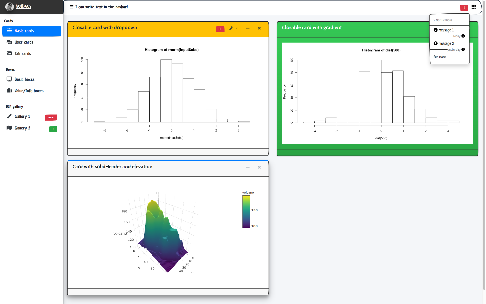

There are currently two supported themes for bs4Dash: the classic one and an old
school theme from [bootswatch](https://bootswatch.com/sketchy/). To trigger it,
just set `old_school = TRUE` in the `bs4DashPage()` function.

## Default theme


<br>

```r
library(shiny)
library(bs4Dash)

 shiny::shinyApp(
   ui = bs4DashPage(
     navbar = bs4DashNavbar(),
     sidebar = bs4DashSidebar(
      skin = "light",
      bs4SidebarMenu(
       bs4SidebarHeader("Main content"),
       bs4SidebarMenuItem(
         "Classic theme",
         tabName = "classic",
         icon = "desktop"
       )
      )
     ),
     controlbar = bs4DashControlbar(
      skin = "light"
     ),
     footer = bs4DashFooter(),
     title = "Classic theme",
     body = bs4DashBody(
      bs4TabItems(
       bs4TabItem(
         tabName = "classic",
         fluidRow(
          bs4Box(
           height = "600px",
           title = "Box 1"
          ),
          bs4Box(
           height = "600px",
           title = "Box 2"
          )
         )
       )
      )
     )
   ),
   server = function(input, output) {}
 )
```

## Old school theme


<br>

```r
library(shiny)
library(bs4Dash)

 shiny::shinyApp(
   ui = bs4DashPage(
     old_school = TRUE,
     navbar = bs4DashNavbar(),
     sidebar = bs4DashSidebar(
      skin = "light",
      bs4SidebarMenu(
       bs4SidebarHeader("Main content"),
       bs4SidebarMenuItem(
         "Old-school theme",
         tabName = "old-school",
         icon = "desktop"
       )
      )
     ),
     controlbar = bs4DashControlbar(
      skin = "light"
     ),
     footer = bs4DashFooter(),
     title = "Old-school theme",
     body = bs4DashBody(
      bs4TabItems(
       bs4TabItem(
         tabName = "old-school",
         fluidRow(
          bs4Box(
           height = "600px",
           title = "Box 1"
          ),
          bs4Box(
           height = "600px",
           title = "Box 2"
          )
         )
       )
      )
     )
   ),
   server = function(input, output) {}
 )
```

## Limitations

Currently, the right and left siderbars are not handled by the old school design,
but elements inside are correctly converted, as they are treated as proper elements. 
This is due to the fact that the original boostwatch *sketchy* theme does not have any sidebar. 