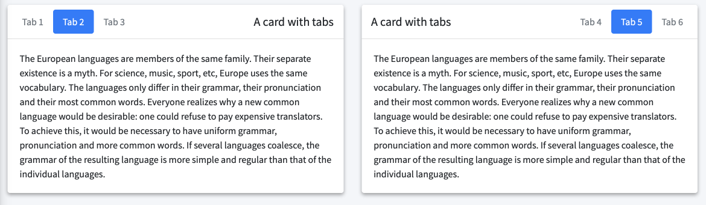
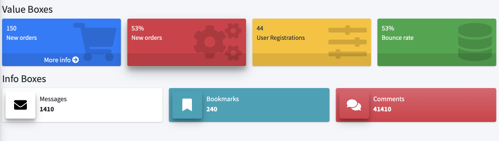

## Classic Cards

bs4Dash comes with a lot of bootstrap 4 cards

See `bs4Card()`.


<br>

<details>
<summary>Code</summary>
```r
fluidRow(
    bs4Card(
      title = "Closable card with dropdown", 
      closable = TRUE, 
      width = 6,
      status = "warning", 
      solidHeader = FALSE, 
      collapsible = TRUE,
      labelText = 1,
      labelStatus = "danger",
      labelTooltip = "Hi Bro!",
      dropdownIcon = "wrench",
      dropdownMenu = dropdownItemList(
        dropdownItem(url = "https://www.google.com", name = "Link to google"),
        dropdownItem(url = "#", name = "item 2"),
        dropdownDivider(),
        dropdownItem(url = "#", name = "item 3")
      ),
      plotOutput("plot")
    ),
    bs4Card(
      title = "Closable card with gradient", 
      closable = TRUE, 
      width = 6,
      status = "warning", 
      solidHeader = FALSE, 
      gradientColor = "success",
      collapsible = TRUE,
      plotOutput("distPlot")
    ),
    bs4Card(
      title = "Card with solidHeader and elevation", 
      elevation = 4,
      closable = TRUE, 
      width = 6,
      solidHeader = TRUE, 
      status = "primary",
      collapsible = TRUE,
      plot_ly(z = ~volcano) %>% add_surface()
    )
  )
```
</details>
<br>

## Social Cards

See `bs4UserCard()` and `bs4SocialCard()`.


<br>

<details>
<summary>Code</summary>
```r
fluidRow(
    bs4UserCard(
      src = "https://adminlte.io/themes/AdminLTE/dist/img/user1-128x128.jpg",
      status = "info",
      title = "User card type 1",
      subtitle = "a subtitle here",
      elevation = 4,
      "Any content here"
    ),
    bs4UserCard(
      type = 2,
      src = "https://adminlte.io/themes/AdminLTE/dist/img/user7-128x128.jpg",
      status = "success",
      imageElevation = 4,
      title = "User card type 2",
      subtitle = "a subtitle here",
      bs4ProgressBar(
        value = 5,
        striped = FALSE,
        status = "info"
      ),
      bs4ProgressBar(
        value = 5,
        striped = TRUE,
        status = "warning",
        width = "20%"
      )
    )
  ),
  fluidRow(
    bs4SocialCard(
      title = "Social Card",
      subtitle = "example-01.05.2018",
      src = "https://adminlte.io/themes/AdminLTE/dist/img/user4-128x128.jpg",
      "Some text here!",
      comments = tagList(
        lapply(X = 1:10, FUN = function(i) {
          cardComment(
            src = "https://adminlte.io/themes/AdminLTE/dist/img/user3-128x128.jpg",
            title = paste("Comment", i),
            date = "01.05.2018",
            paste0("The ", i, "-th comment")
          )
        })
      ),
      footer = "The footer here!"
    ),
    bs4Card(
      title = "Box with user comment",
      status = "primary",
      userPost(
        id = 1,
        src = "https://adminlte.io/themes/AdminLTE/dist/img/user1-128x128.jpg",
        author = "Jonathan Burke Jr.",
        description = "Shared publicly - 7:30 PM today",
        "Lorem ipsum represents a long-held tradition for designers, 
       typographers and the like. Some people hate it and argue for 
       its demise, but others ignore the hate as they create awesome 
       tools to help create filler text for everyone from bacon 
       lovers to Charlie Sheen fans.",
        userPostTagItems(
          userPostTagItem(bs4Badge("item 1", status = "warning")),
          userPostTagItem(bs4Badge("item 2", status = "danger"))
        )
      ),
      userPost(
        id = 2,
        src = "https://adminlte.io/themes/AdminLTE/dist/img/user6-128x128.jpg",
        author = "Adam Jones",
        description = "Shared publicly - 5 days ago",
        userPostMedia(src = "https://adminlte.io/themes/AdminLTE/dist/img/photo2.png"),
        userPostTagItems(
          userPostTagItem(bs4Badge("item 1", status = "info")),
          userPostTagItem(bs4Badge("item 2", status = "danger"))
        )
      )
    )
  ),
  fluidRow(
    bs4Card(
      status = "primary",
      width = 3,
      solidHeader = TRUE,
      cardProfile(
        src = "https://adminlte.io/themes/AdminLTE/dist/img/user4-128x128.jpg",
        title = "Nina Mcintire",
        subtitle = "Software Engineer",
        cardProfileItemList(
          bordered = TRUE,
          cardProfileItem(
            title = "Followers",
            description = 1322
          ),
          cardProfileItem(
            title = "Following",
            description = 543
          ),
          cardProfileItem(
            title = "Friends",
            description = 13287
          )
        )
      )
    ),
    bs4Card(
      title = "Card with messages",
      width = 9,
      userMessages(
        width = 12,
        status = "success",
        userMessage(
          author = "Alexander Pierce",
          date = "20 Jan 2:00 pm",
          src = "https://adminlte.io/themes/AdminLTE/dist/img/user1-128x128.jpg",
          side = NULL,
          "Is this template really for free? That's unbelievable!"
        ),
        userMessage(
          author = "Dana Pierce",
          date = "21 Jan 4:00 pm",
          src = "https://adminlte.io/themes/AdminLTE/dist/img/user5-128x128.jpg",
          side = "right",
          "Indeed, that's unbelievable!"
        )
      )
    )
  )
```
</details>
<br>

## Tab Cards

See `bs4TabCard()`.


<br>

<details>
<summary>Code</summary>
```r
fluidRow(
    column(
      width = 6,
      bs4TabCard(
        title = "A card with tabs",
        elevation = 2,
        width = 12,
        bs4TabPanel(
          tabName = "Tab 1",
          active = FALSE,
          "A wonderful serenity has taken possession of my entire soul,
          like these sweet mornings of spring which I enjoy with my
          whole heart. I am alone, and feel the charm of existence in
          this spot, which was created for the bliss of souls like mine.
          I am so happy, my dear friend, so absorbed in the exquisite sense
          of mere tranquil existence, that I neglect my talents. I should be
          incapable of drawing a single stroke at the present moment; and yet
          I feel that I never was a greater artist than now"
        ),
        bs4TabPanel(
          tabName = "Tab 2",
          active = TRUE,
          "The European languages are members of the same family.
          Their separate existence is a myth. For science, music,
          sport, etc, Europe uses the same vocabulary. The languages
          only differ in their grammar, their pronunciation and their
          most common words. Everyone realizes why a new common
          language would be desirable: one could refuse to pay expensive
          translators. To achieve this, it would be necessary to have
          uniform grammar, pronunciation and more common words. If several
          languages coalesce, the grammar of the resulting language is
          more simple and regular than that of the individual languages."
        ),
        bs4TabPanel(
          tabName = "Tab 3",
          active = FALSE,
          "Lorem Ipsum is simply dummy text of the printing and
          typesetting industry. Lorem Ipsum has been the industry's
          standard dummy text ever since the 1500s, when an unknown
          printer took a galley of type and scrambled it to make a
          type specimen book. It has survived not only five centuries,
          but also the leap into electronic typesetting, remaining
          essentially unchanged. It was popularised in the 1960s with
          the release of Letraset sheets containing Lorem Ipsum passages,
          and more recently with desktop publishing software like Aldus
          PageMaker including versions of Lorem Ipsum."
        )
      )
    ),
    column(
      width = 6,
      bs4TabCard(
        title = "A card with tabs",
        side = "right",
        elevation = 2,
        width = 12,
        bs4TabPanel(
          tabName = "Tab 4",
          active = FALSE,
          "A wonderful serenity has taken possession of my entire soul,
          like these sweet mornings of spring which I enjoy with my
          whole heart. I am alone, and feel the charm of existence in
          this spot, which was created for the bliss of souls like mine.
          I am so happy, my dear friend, so absorbed in the exquisite sense
          of mere tranquil existence, that I neglect my talents. I should be
          incapable of drawing a single stroke at the present moment; and yet
          I feel that I never was a greater artist than now"
        ),
        bs4TabPanel(
          tabName = "Tab 5",
          active = TRUE,
          "The European languages are members of the same family.
          Their separate existence is a myth. For science, music,
          sport, etc, Europe uses the same vocabulary. The languages
          only differ in their grammar, their pronunciation and their
          most common words. Everyone realizes why a new common
          language would be desirable: one could refuse to pay expensive
          translators. To achieve this, it would be necessary to have
          uniform grammar, pronunciation and more common words. If several
          languages coalesce, the grammar of the resulting language is
          more simple and regular than that of the individual languages."
        ),
        bs4TabPanel(
          tabName = "Tab 6",
          active = FALSE,
          "Lorem Ipsum is simply dummy text of the printing and
          typesetting industry. Lorem Ipsum has been the industry's
          standard dummy text ever since the 1500s, when an unknown
          printer took a galley of type and scrambled it to make a
          type specimen book. It has survived not only five centuries,
          but also the leap into electronic typesetting, remaining
          essentially unchanged. It was popularised in the 1960s with
          the release of Letraset sheets containing Lorem Ipsum passages,
          and more recently with desktop publishing software like Aldus
          PageMaker including versions of Lorem Ipsum."
        )
      )
    )
  )
```
</details>
<br>

## Boxes

See `bs4Box()`.


<br>

<details open>
<summary>Code</summary>
```r
fluidRow(
    bs4Box(
      height = "600px",
      title = "Box 1",
      plotlyOutput("plot2")
    ),
    bs4Box(
      height = "600px",
      title = "Box 2",
      plotlyOutput("plot3")
    )
  )
```
</details>
<br>

## Value and Info Boxes

See `bs4ValueBox()` and `bs4InfoBox()` as well as all render/output functions, that is `renderbs4InfoBox()`, `renderbs4ValueBox()`, `infoBoxOutput()` and `valueBoxOutput()`.

<br>

<details>
<summary>Code</summary>
```r
h4("Value Boxes"),
  fluidRow(
    bs4ValueBox(
      value = 150,
      subtitle = "New orders",
      status = "primary",
      icon = "shopping-cart",
      href = "#"
    ),
    bs4ValueBox(
      elevation = 4,
      value = "53%",
      subtitle = "New orders",
      status = "danger",
      icon = "cogs"
    ),
    bs4ValueBox(
      value = "44",
      subtitle = "User Registrations",
      status = "warning",
      icon = "sliders"
    ),
    bs4ValueBox(
      value = "53%",
      subtitle = "Bounce rate",
      status = "success",
      icon = "database"
    )
  ),
  h4("Info Boxes"),
  fluidRow(
    bs4InfoBox(
      title = "Messages",
      value = 1410,
      icon = "envelope"
    ),
    bs4InfoBox(
      title = "Bookmarks",
      status = "info",
      value = 240,
      icon = "bookmark"
    ),
    bs4InfoBox(
      title = "Comments",
      gradientColor = "danger",
      value = 41410,
      icon = "comments"
    )
  )
```
</details>
<br>


bs4InfoCard may now be used to navigate between body tabs, similarly to what happens in the sidebar:

<details>
<summary>Code</summary>
```{r, eval = FALSE}
shiny::shinyApp(
  ui = bs4DashPage(
    enable_preloader = TRUE,
    navbar = bs4DashNavbar(),
    sidebar = bs4DashSidebar(
      bs4SidebarMenu(
        bs4SidebarMenuItem(
          tabName = "Tab1",
          text = "Tab 1",
          icon = "card"
        ),
        bs4SidebarMenuItem(
          tabName = "Tab2",
          text = "Tab 2",
          icon = "card"
        )
      )
    ),
    controlbar = bs4DashControlbar(),
    footer = bs4DashFooter(),
    title = "test",
    body = bs4DashBody(
      bs4TabItems(
        bs4TabItem(
          tabName = "Tab1",
          bs4InfoBox(
            title = "Messages",
            value = "You are on Tab 1",
            icon = "envelope",
            tabName = "Tab2"
          )
        ),
        bs4TabItem(
          tabName = "Tab2",
          bs4InfoBox(
            title = "Messages",
            value = "You are on Tab 2",
            icon = "envelope",
            tabName = "Tab1"
          )
        )
      )
    )
  ),
  server = function(input, output) {}
)
```
</details>
<br>