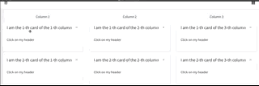

## Sortable Containers

With bs4Dash, it is possible to sort elements by row and columns without the need of any external package.
This does not work on mobiles.


<br>

<details open>
<summary>Code</summary>
```r
library(shiny)
 library(bs4Dash)
 shiny::shinyApp(
  ui = bs4DashPage(
    navbar = bs4DashNavbar(),
    sidebar = bs4DashSidebar(),
    controlbar = bs4DashControlbar(),
    footer = bs4DashFooter(),
    title = "test",
    body = bs4DashBody(
      bs4TabItems(
        bs4TabItem(
          tabName = "sortabled",
          fluidRow(
            lapply(1:3, FUN = function(i) {
              bs4Sortable(
                width = 4,
                p(class = "text-center", paste("Column", i)),
                lapply(1:2, FUN = function(j) {
                  bs4Card(
                    title = paste0("I am the ", j,"-th card of the ", i, "-th column"), 
                    width = 12,
                    "Click on my header"
                  )
                })
              )
            })
          )
        )
      )
    )
  ),
  server = function(input, output) {}
 )
```
</details>
<br>

## Limitations
Only works with `bs4Card()`, `bs4TabCard()`, `bs4SocialCard()` and `bs4Box()`.